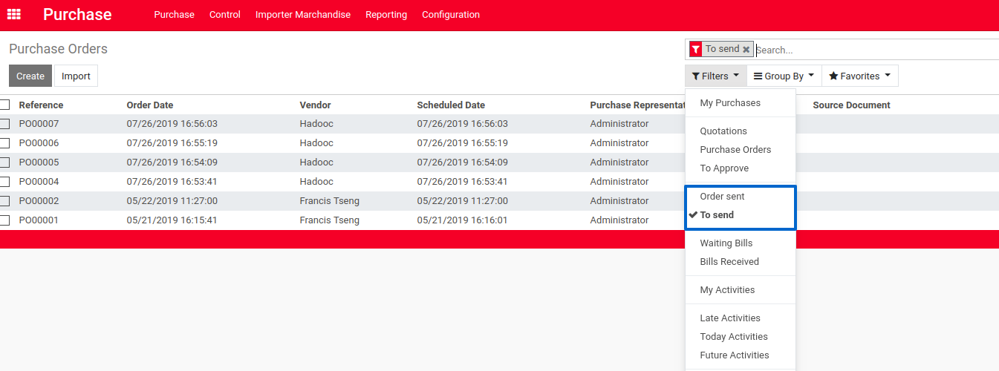
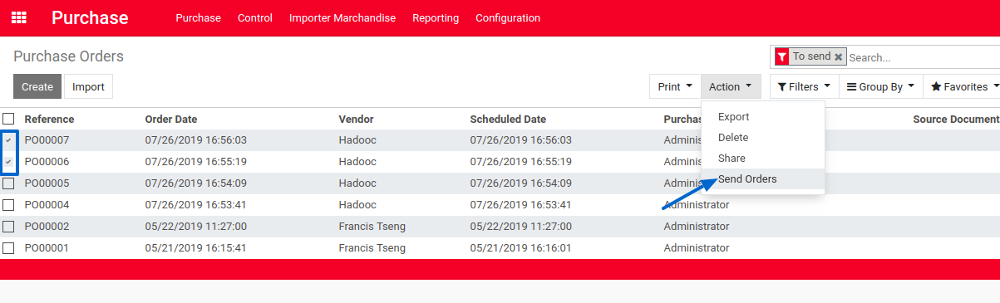
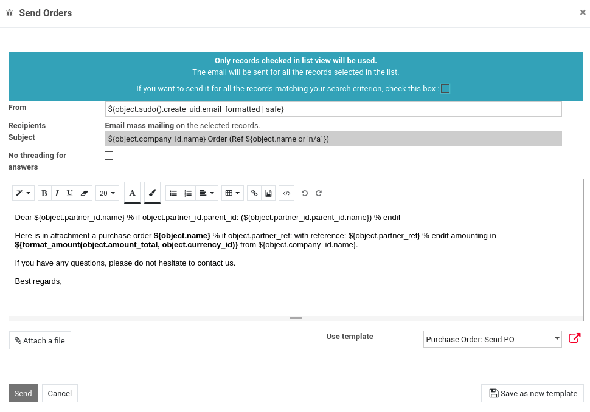
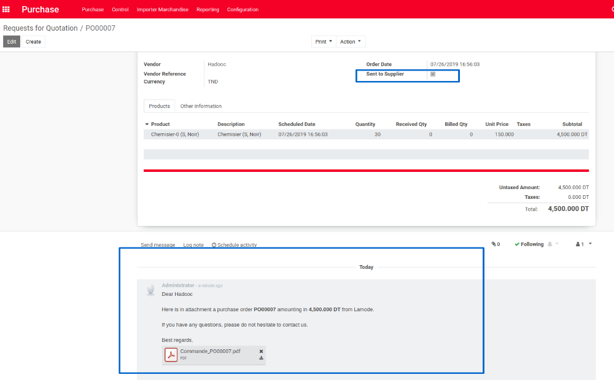

Mass Emailing Purchase Orders
=============================

This module allows to send mass email of Purchase Orders and mark theses PO as sent to supplier.

Usage
-----

* Go to Menu Purchase--> Requests for Quotation or Purchase--> Purchase Orders and select filtre 'To send'

* Select list of orders to be send

* Wizard Send orders

* Orders are marked as sent and email added to chatter.

Contributors
------------
* Numigi (tm) and all its contributors (https://bit.ly/numigiens)
